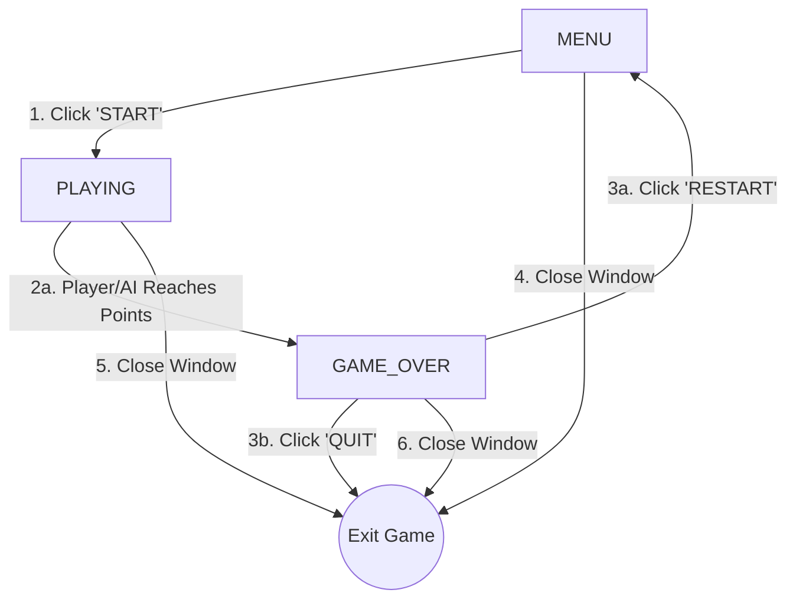

```mermaid
graph TD
    A[MENU] -->|1. Click 'START'| B[PLAYING]
    B -->|2a. Player/AI Reaches Points| C[GAME_OVER]
    C -->|3a. Click 'RESTART'| A
    C -->|3b. Click 'QUIT'| D((Exit Game))
    A -->|4. Close Window| D
    B -->|5. Close Window| D
    C -->|6. Close Window| D
```
